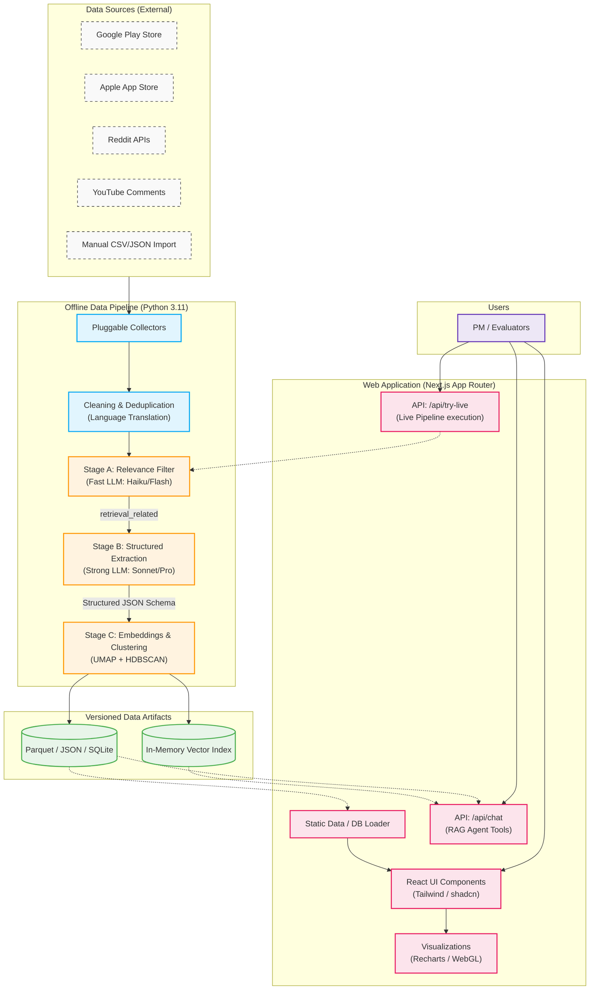

# RecallScope: System Architecture

This document details the system architecture for **RecallScope**, an AI-powered discovery engine for vague-memory photo retrieval. The architecture is split into two primary domains: an offline Python data pipeline for collection and LLM-based extraction, and an online Next.js application for serving insights.

---

## 1. High-Level Architecture Diagram



---

## 2. Offline Data Pipeline

The data pipeline is a set of reproducible Python 3.11 scripts designed to run locally, transforming raw, unstructured user feedback into highly structured, verifiable evidence.

### 2.1 Pluggable Collectors
- **Implementation**: Abstract collector interfaces that output standard raw schemas.
- **Technologies**: `google-play-scraper`, `PRAW` (Reddit API), YouTube Data API v3.
- **Resilience**: Caches all raw API responses to disk locally to allow for resumable, idempotent runs without burning API quotas.

### 2.2 Data Cleaning
- **Operations**: Exact and near-duplicate removal (via fast embeddings or hashing). Language detection and automated translation to English (while retaining the original text for reference).

### 2.3 LLM Extraction Pipeline
*Utilizes LLM APIs (Anthropic/Google) managed via environment variables.*
- **Stage A (Relevance Filter)**: Uses a fast, inexpensive model (e.g., Claude 3 Haiku or Gemini 1.5 Flash) to filter out noise, outputting a simple `retrieval_related` classification.
- **Stage B (Structured Extraction)**: Uses a powerful model (e.g., Claude 3.5 Sonnet or Gemini 1.5 Pro) with strict JSON schema enforcement (via `Pydantic` or Tool Calling) to extract the Funnel stage (F1-F6), archetype mappings, and verbatim `evidence_quotes`.
- **Stage C (Embeddings & Discovery)**: Generates text embeddings for the extracted records. Uses `umap-learn` for dimensionality reduction and `hdbscan` for density-based clustering to automatically discover novel retrieval problem archetypes that the PM did not preemptively think of.

### 2.4 Artifact Generation
- Output is exported directly to precomputed static files: `JSON`, `SQLite`, or `Parquet` formats.
- A local Vector index is also compiled for RAG features.

---

## 3. Web Application

The frontend is a static/serverless hybrid Next.js application designed for public, zero-friction access by evaluators.

### 3.1 Core Stack
- **Framework**: Next.js (App Router) + TypeScript.
- **Styling**: Tailwind CSS + `shadcn/ui` for a clean, accessible, "editorial" design system.
- **Data Fetching**: The app reads directly from the precomputed data artifacts (JSON/SQLite/Parquet) bundled with the build or loaded server-side. This removes the need for a live database server, cutting latency and costs.

### 3.2 Visualization Layer
- **Standard Charts**: Built using `Recharts` (or D3/visx for more complex layouts).
- **Cluster Map**: The Discovery Map renders 2D UMAP coordinates using an HTML5 `<canvas>` or lightweight WebGL implementation to ensure smooth 60fps performance across thousands of points.

### 3.3 Dynamic Features (API Routes)
Because the core app relies on static data, API routes are reserved only for LLM interactions.
- **"Ask the Evidence" (`/api/chat`)**: A grounded conversational RAG agent. It is equipped with tools like `sql_query` (to hit the SQLite data) and `semantic_search` (to hit the in-memory vector index). It generates responses with mandatory `[#record_id]` citation chips.
- **"Try It Live" (`/api/try-live`)**: Accepts a user-pasted snippet and runs it directly against the Python pipeline logic (ported or wrapped) to demonstrate real-time Stage A and Stage B LLM extraction. Enforces strict rate limits and budget caps.

### 3.4 Deployment
- **Platform**: Vercel (or similar Edge/Serverless platforms).
- **Security**: No logins required (frictionless for judges). API keys are stored server-side. CORS headers and IP rate limiting are implemented on the `/api` routes to prevent abuse.

---

## 4. Reproducibility & Orchestration

To ensure the engine can be updated easily, the entire pipeline is managed via a `Makefile` or a simple task runner.

```bash
# Example developer workflow
make collect
make clean
make filter
make extract
make embed
make cluster
make score
make build
```
